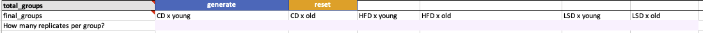

## Introduction {.tabset .color-tabs .tabset-pills}

Hey there! This tutorial should guide you through your own first steps to fill in the Metadata sheet for an example outlined here. Once you are familiar with the principles of the sheet and the requested information it should be easy for you to move on to your own experiments. Remember, you filling in the sheet along with your data will not only have benefits for you (e.g. using ShinyOmics) but also for the SFB community!

Please prepare:

-   open a new [Metadata Sheet](https://uni-bonn.sciebo.de/f/1965488410)
    -   make sure to allow the Macros

    -   you might get asked if you want to update, which you can handle as you like

You will first be introduced into the example dataset. You probably will need to come back multiple times to the section to be able to fill in the metadata sheet.

### Example Data - bulk transcriptomics

#### Example Data - bulk transcriptomics {#example-data---bulk-transcriptomics-1}

Imagine the following experimental SetUp:

{width="709"}

Additional Information:

-   this is a single experiment and is not linked to any other

-   the adipozytes are taken from the liver

-   all mouse are male

-   you recorded the weight of each mouse

-   you have prepped the samples all at the same day

### Trouble Shoot

#### Trouble Shoot

The Metadata-Sheet is still work-in-progress so you might experience unexpected behavior or no behavior at all.

Your first try should be always to click validate and wait. If your problem does not resolve try to reset the section you have trouble with. Here, try to reset the cell from top to bottom.

If all of this does not help you might need to completely reset your Sheet (attention this will need an entire rework of the sheet). If you experience misbehavior every time you do a certain action please contact [lea.seep\@uni-bonn.de](mailto:lea.seep@uni-bonn.de){.email}.

If an Excel-Error message pops up please first click validate before moving on!

## Metadata-Sheet

Given the information from [Example Data - bulk transcriptomics](#example-data---bulk-transcriptomics-1) you are now asked to fill in the three Sections of the Sheet sequentially.

### Section 1

**Task:** Fill in Section 1! For this:

1.  click 'Reset all' do make sure it a clear new sheet

2.  click on 'validate' to also ensure the background is all clear and fresh (Wait as long as the Sheet tells you!)

3.  fill in 'General', mock up anything that is not given

4.  fill in the 'Experimental System' (note to first select the experimental system before filling preceeding cells)

5.  fill in the remainder of the section 1.

    **Note:** There are extensive help text and comments that should help you. Please report anything you find confusing or not helpful. Please report cells that you could not fill in.

### Section 2

#### Generate the final groups

1.  Press 'generate' to generate the total groups. Compare your result with the snippet below. It should show be the same!

    

    

    

2.  Now look at the second snippet. Change the first section accordingly to achieve the same result shown below:

    

    

    

3.  Decide whether you want to use the simple setting (1.) then change Section 1 again or move on with the advanced setting. Fill in the number of replicates (duplicates per group)

#### Covariates & Constants

"**Covariates:** Variables that affect a response variable, but are not of interest in a study." Note: this could for example explain an observed batch effect. Are within the metadatasheet any information that is captured for each individual sample you also have measurement data for.

**Task:** Given the reminder of what a covariate is fill in the section based on the given information ([Example Data - bulk transcriptomics](#example-data---bulk-transcriptomics-1))

#### Time-Dependence timeline

**Task:** We will skip in this setting any time-dependence. Choose appropriate option within the sheet.

#### Preparation & Measurement & DataFiles-Linkage

The preparation is referring to the preparation form the experimental system to the actual material that is given to the measurement device. This protocols are highly varying and would be difficult to capture as well in a controlled fashion. Moreover maybe different protocols apply to the different groups as different steps were take for preparing the highfat mice.

1.  Identify for the given scenario what we refer to as preparation.
2.  Check out the current drop-down options for 'procedure'. Choose the appropriate on for the give setting. **Note:** In a real setting, we would need you to be able to provide the used protocol upon our request (e.g. Experiment-Title & Date+ procedure should be enough for you to provide the needed information)
3.  Fill in the remainder of the section. In case of missing information please select the most common to you.

**Note:** The count matrix is actually already processed, corresponding raw data would be fastq's. The core facilities use normally standard protocols which can be indicate the protocol type of default.

### Section 3

1.  Click on 'generate' to generate the Sample-Section

Now the information given above is combined and resulting table will give you the possibility to fill in the covariates per sample. To do so we arrive at the most crucial part of this metadata sheet: The ID matching. As you know, during the measurement each ID gets a unique identifier. This is the connection between the measurement and the metadata.

2.  Given the table of IDs and attached data transfer the information to the Metadatasheet:
    1.  Table 1 (for simple setting)

        | measurement ID | internal ID | group | replicate |
        |----------------|-------------|-------|-----------|
        | NGS_1001       | CD_1        | CD    | 1         |
        | NGS_1002       | HFD_1       | HFD   | 1         |
        | NGS_1003       | CD_2        | CD    | 2         |
        | NGS_1004       | HFD_2       | HFD   | 2         |

    2.  Table 2 (for advanced setting)

        | measurement ID | internal ID  | group | replicate |
        |----------------|--------------|-------|-----------|
        | NGS_1001       | 2Weeks_CD_1  | young | 1         |
        | NGS_1002       | 2Weeks_CD_2  | young | 2         |
        | NGS_1003       | 4Weeks_CD_1  | old   | 1         |
        | NGS_1004       | 4Weeks_CD_2  | old   | 2         |
        | NGS_1005       | 2Weeks_HFD_1 | young | 1         |
        | NGS_1006       | 2Weeks_HFD_2 | young | 2         |
        | NGS_1007       | 4Weeks_HFD_1 | old   | 1         |
        | NGS_1008       | 4Weeks_HFD_2 | old   | 2         |
        | NGS_1009       | 2Weeks_LFD_1 | young | 1         |
        | NGS_1010       | 2Weeks_LFD_2 | young | 2         |
        | NGS_1011       | 4Weeks_LFD_1 | old   | 1         |
        | NGS_1012       | 4Weeks_LFD_2 | old   | 2         |

### Export

Export the Metadata-Sheet.

1.  Find the metadata Sheet in your file system.
2.  Compare your result with the given solution. Identify differences (if any) and try to explain those.

------------------------------------------------------------------------

## Advanced usability

We have no worked through the most simplest case. The sheet is capable to capture more complicated set-ups. Some of those advanced settings are not introduced to you.

### Adding timeline to treatment

As already indicated in the original set up ([Example Data - bulk transcriptomics](#example-data---bulk-transcriptomics-1)) the comparison groups have an attached timeline.

1.  Go to Section 2 Time-Dependence Timeline and select 'yes' for whether interruptions were recorded.
2.  Make yourself familiar with the difference between the Interruption type continued and discontinued
3.  Choose the appropriate option and fill in the timeline

Note: The timeline adds more information to one of the comparison groups (e.g. the Diet changes). If you want to compare certain timepoints or timelines, this would count as comparison group!

1.  Imagine you want to compare the effect of different timelines (Timeline A, Timeline B). Fill in Section 1 and 2 appropriately.

    Timeline A: 1.10.22-15.10.22 CD and 16.10.22-31.10.22 HFD

    Timeline B: 1.10.22-30.10.22 CD and 31.10.22-31.10.22 HFD

### Adding subsamples

You may face the situation that you have isolated 2 different celltypes from the same mouse. The preparation needs two differing procedures. Moreover, you want to record the covariate of weight per mouse as well as the isolated cellnumber for each celltype per mouse. (see picture)

1.  Your specimen (in this case cells) are differently processed. Go to respective cell and choose the appropriate option.
2.  Fill in the new expanded section.
3.  Revise the Preparation Section. Can you pin point the cell which needs to be changed when you add subsamples or subsubsamples?

### Keyword 'CHANGES'

Whenever you select from the DropDown the option "CHANGES" the corresponding key including the DropDown will be propagated to the Sample-Section. Now you can specify the requested value for the respective key now for each individual sample.

1.  Think about similarities and differences between a covariate and the use of the keyword CHANGES
2.  Go to the Measurement Section and select as measurement type flow_cytometry. Mock up the other requested keys except 'markers'. Here choose CHANGES
3.  **Before** clickinggenerate think about, where you expect the key 'markers' to pop up again.
4.  Click generate and check your expectation. Try to select several markers.
5.  Can you think of other keys within the Sheet that would need the keyword CHANGES? Check if you can find it. If not please report the keys you would like to see the keyword CHANGES.
